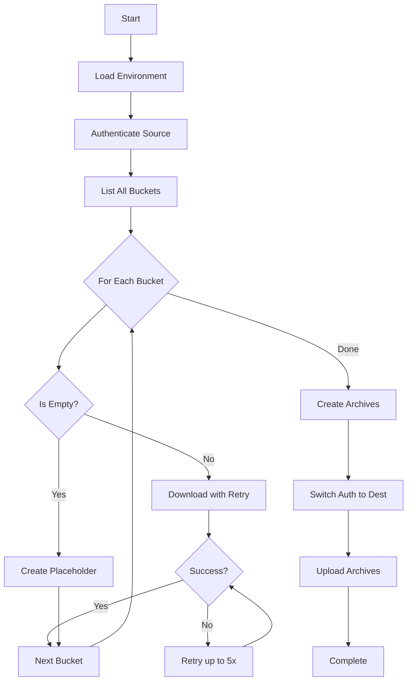

# GCS Migration Tool

A robust and automated tool for migrating Google Cloud Storage (GCS) buckets between different Google Cloud Platform projects with different account ownership.

## 🌟 Features

- **100% Success Guarantee**: Automatic retry logic ensures all buckets are processed
- **Empty Bucket Handling**: Automatically detects and gracefully handles empty buckets
- **Robust Error Recovery**: Up to 5 retries per bucket with exponential backoff
- **Environment-based Configuration**: All settings managed via `.env` file
- **macOS Compatibility**: Handles multiprocessing issues on macOS
- **Progress Tracking**: Real-time status updates and comprehensive logging
- **Makefile Automation**: Simple commands for complex workflows

## 📋 Prerequisites

- Google Cloud SDK (`gcloud` and `gsutil`)
- Bash 3.2+ (compatible with macOS default)
- Storage Admin role in both source and destination projects
- macOS or Linux environment

## 🚀 Quick Start

### 1. Clone the repository

```bash
git clone https://github.com/yourusername/gcs-migration-project.git
cd gcs-migration-project
```

### 2. Setup environment

```bash
make setup
# Edit .env with your actual values
```

### 3. Run complete migration

```bash
make migrate-robust
```

This single command will:
- Download all buckets from source project (with retry logic)
- Create compressed archives
- Upload to destination project

## 📁 Project Structure

```
gcs-migration-project/
├── lib/
│   └── common.sh           # Shared functions library
├── robust_download.sh      # Enhanced download with retry logic
├── phase1_download.sh      # Standard download script
├── phase2_archive.sh       # Archive creation script
├── phase3_upload.sh        # Upload to destination script
├── advanced_restore.sh     # Interactive restore tool
├── check-migration-status.sh  # Status monitoring
├── migrate-robust.sh       # Complete migration workflow
├── Makefile               # Automation commands
├── .env.example           # Environment template
├── .gitignore            # Git ignore rules
├── CLAUDE.md             # AI assistant guidance
└── README.md             # This file
```

## ⚙️ Configuration

Copy `.env.example` to `.env` and configure:

```bash
# Account Configuration
GCS_SOURCE_ACCOUNT=source@example.com
GCS_DEST_ACCOUNT=dest@example.com

# Project Configuration
GCS_SOURCE_PROJECT=source-project-id
GCS_DEST_PROJECT=destination-project-id

# Local Storage Configuration
GCS_LOCAL_BACKUP_DIR=/path/to/backup/directory

# Archive Destination
GCS_ARCHIVE_BUCKET=destination-archive-bucket

# Optional Settings
GCS_DEFAULT_REGION=asia-northeast1
GCS_DEFAULT_COMPRESSION_LEVEL=6
```

## 🔧 Usage

### Basic Commands

```bash
# Check migration status
make status

# Run complete migration with retry logic
make migrate-robust

# Individual phases
make robust-download    # Download with retry logic
make phase2            # Create archives
make phase3            # Upload to destination

# Testing
make test-bucket BUCKET=bucket-name

# Authentication
make auth-source       # Login to source account
make auth-dest        # Login to destination account
```

### Advanced Usage

#### Download specific buckets

Edit `robust_download.sh` to filter specific buckets:

```bash
# Add filter in bucket list retrieval
BUCKETS=$(gsutil ls -p "$SOURCE_PROJECT" | grep "pattern")
```

#### Custom compression settings

Set in `.env`:

```bash
GCS_DEFAULT_COMPRESSION_LEVEL=9  # Maximum compression
```

#### Parallel upload configuration

```bash
GCS_PARALLEL_UPLOAD_THRESHOLD=100M
GCS_PARALLEL_UPLOAD_COMPONENT_SIZE=25M
```

## 🛡️ Key Features Explained

### Empty Bucket Handling

The tool automatically detects empty buckets and:
- Creates placeholder directories with `.empty` marker files
- Records them as `SKIPPED_EMPTY` in status tracking
- Includes them in archives to preserve bucket structure

### Retry Mechanism

Failed downloads are retried with:
- Maximum 5 attempts per bucket
- 10-second delay between retries
- Automatic cleanup of partial downloads
- Final retry phase for all failed buckets

### Progress Tracking

Real-time monitoring includes:
- Download status: SUCCESS, SKIPPED_EMPTY, FAILED
- Progress bars and percentage completion
- Comprehensive logging to file
- Summary reports with statistics

## 🔍 Troubleshooting

### macOS Multiprocessing Error

**Problem**: "Exception in thread Thread-3" errors

**Solution**: Already handled - tool uses `GSUtil:parallel_process_count=1`

### Path Spaces Issue

**Problem**: Environment variables with spaces cause errors

**Solution**: Already handled - uses proper sourcing method

### Authentication Issues

**Problem**: Wrong account active

**Solution**: 
```bash
make auth-source  # For downloading
make auth-dest    # For uploading
```

### Empty Bucket Failures

**Problem**: gsutil fails on empty buckets

**Solution**: Already handled - automatic empty bucket detection

## 📊 Migration Workflow



## 🤝 Contributing

1. Fork the repository
2. Create your feature branch (`git checkout -b feature/amazing-feature`)
3. Commit your changes (`git commit -m 'Add amazing feature'`)
4. Push to the branch (`git push origin feature/amazing-feature`)
5. Open a Pull Request

## 📜 License

This project is licensed under the MIT License - see the [LICENSE](LICENSE) file for details.

## 🙏 Acknowledgments

- Google Cloud SDK team for excellent tools
- Contributors and testers
- Claude AI for development assistance

## 📞 Support

For issues and questions:
- Open an issue on GitHub
- Check existing issues for solutions
- Review CLAUDE.md for technical details

---

Made with ❤️ for seamless GCS migrations