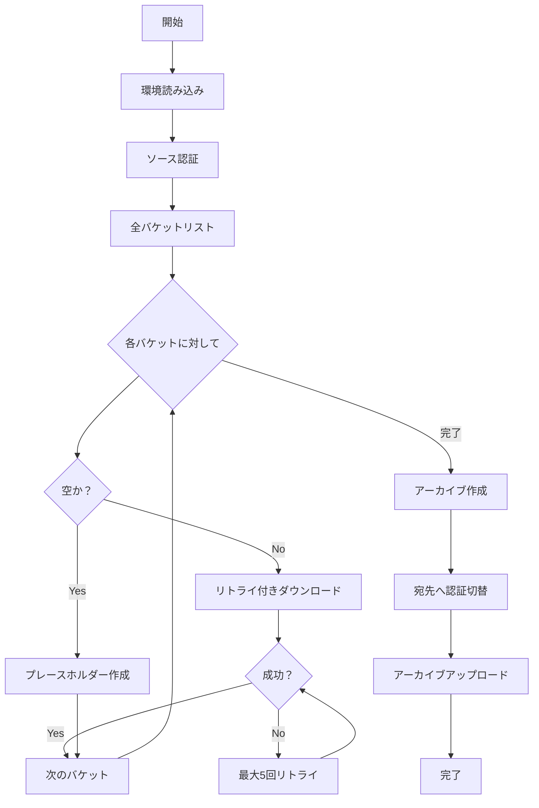

# GCS移行ツール

[English README](README.md)

異なるGoogle Cloudアカウント間でGoogle Cloud Storage (GCS) バケットを移行するための堅牢で自動化されたツールです。

## 🌟 主な機能

- **100%成功保証**: 自動リトライロジックによりすべてのバケットを確実に処理
- **空バケット処理**: 空のバケットを自動検出し、適切に処理
- **堅牢なエラー回復**: バケットごとに最大5回のリトライ（バックオフ付き）
- **環境変数ベースの設定**: すべての設定を`.env`ファイルで管理
- **macOS互換性**: macOSのマルチプロセッシング問題に対応
- **進捗追跡**: リアルタイムのステータス更新と包括的なログ記録
- **Makefile自動化**: 複雑なワークフローを簡単なコマンドで実行

## 📋 前提条件

- Google Cloud SDK (`gcloud`と`gsutil`)
- Bash 3.2以上（macOSデフォルトと互換）
- ソースと宛先プロジェクトでのStorage Admin権限
- macOSまたはLinux環境

## 🚀 クイックスタート

### 1. リポジトリのクローン

```bash
git clone https://github.com/yourusername/gcs-migration-project.git
cd gcs-migration-project
```

### 2. 環境設定

```bash
make setup
# .envファイルを実際の値で編集
```

### 3. 完全な移行を実行

```bash
make migrate-robust
```

このコマンド一つで以下を実行します：
- ソースプロジェクトからすべてのバケットをダウンロード（リトライロジック付き）
- 圧縮アーカイブを作成
- 宛先プロジェクトへアップロード

## 📁 プロジェクト構造

```
gcs-migration-project/
├── lib/
│   └── common.sh           # 共有関数ライブラリ
├── robust_download.sh      # リトライロジック付き強化版ダウンロード
├── phase1_download.sh      # 標準ダウンロードスクリプト
├── phase2_archive.sh       # アーカイブ作成スクリプト
├── phase2_archive_auto.sh  # 自動化版アーカイブ作成
├── phase3_upload.sh        # 宛先へのアップロードスクリプト
├── advanced_restore.sh     # インタラクティブ復元ツール
├── check-migration-status.sh  # ステータス監視
├── migrate-robust.sh       # 完全な移行ワークフロー
├── Makefile               # 自動化コマンド
├── .env.example           # 環境テンプレート
├── .gitignore            # Git除外ルール
├── CLAUDE.md             # AIアシスタントガイダンス
├── README.md             # 英語版README
└── README_ja.md          # このファイル
```

## ⚙️ 設定

`.env.example`を`.env`にコピーして設定：

```bash
# アカウント設定
GCS_SOURCE_ACCOUNT=source@example.com
GCS_DEST_ACCOUNT=dest@example.com

# プロジェクト設定
GCS_SOURCE_PROJECT=source-project-id
GCS_DEST_PROJECT=destination-project-id

# ローカルストレージ設定
GCS_LOCAL_BACKUP_DIR=/path/to/backup/directory

# アーカイブ宛先
GCS_ARCHIVE_BUCKET=destination-archive-bucket

# オプション設定
GCS_DEFAULT_REGION=asia-northeast1
GCS_DEFAULT_COMPRESSION_LEVEL=6
```

## 🔧 使用方法

### 基本コマンド

```bash
# 移行ステータスの確認
make status

# リトライロジック付き完全移行の実行
make migrate-robust

# 個別フェーズ
make robust-download    # リトライロジック付きダウンロード
make phase2            # アーカイブ作成
make phase3            # 宛先へアップロード

# テスト
make test-bucket BUCKET=bucket-name

# 認証
make auth-source       # ソースアカウントでログイン
make auth-dest        # 宛先アカウントでログイン
```

### 高度な使用方法

#### 特定のバケットのみダウンロード

`robust_download.sh`を編集して特定のバケットをフィルタ：

```bash
# バケットリスト取得時にフィルタを追加
BUCKETS=$(gsutil ls -p "$SOURCE_PROJECT" | grep "pattern")
```

#### カスタム圧縮設定

`.env`で設定：

```bash
GCS_DEFAULT_COMPRESSION_LEVEL=9  # 最大圧縮
```

#### 並列アップロード設定

```bash
GCS_PARALLEL_UPLOAD_THRESHOLD=100M
GCS_PARALLEL_UPLOAD_COMPONENT_SIZE=25M
```

## 🛡️ 主要機能の詳細

### 空バケット処理

ツールは空のバケットを自動的に検出し：
- `.empty`マーカーファイル付きのプレースホルダーディレクトリを作成
- ステータストラッキングで`SKIPPED_EMPTY`として記録
- バケット構造を保持するためアーカイブに含める

### リトライメカニズム

失敗したダウンロードのリトライ：
- バケットごとに最大5回の試行
- リトライ間に10秒の遅延
- 部分的なダウンロードの自動クリーンアップ
- すべての失敗したバケットに対する最終リトライフェーズ

### 進捗追跡

リアルタイム監視機能：
- ダウンロードステータス: SUCCESS、SKIPPED_EMPTY、FAILED
- プログレスバーとパーセンテージ表示
- ファイルへの包括的なログ記録
- 統計付きサマリーレポート

## 🔍 トラブルシューティング

### macOSマルチプロセッシングエラー

**問題**: "Exception in thread Thread-3"エラー

**解決策**: すでに対処済み - ツールは`GSUtil:parallel_process_count=1`を使用

### パスのスペース問題

**問題**: スペースを含む環境変数がエラーを起こす

**解決策**: すでに対処済み - 適切なソース方法を使用

### 認証の問題

**問題**: 間違ったアカウントがアクティブ

**解決策**: 
```bash
make auth-source  # ダウンロード用
make auth-dest    # アップロード用
```

### 空バケットの失敗

**問題**: gsutilが空のバケットで失敗

**解決策**: すでに対処済み - 自動空バケット検出

## 📊 移行ワークフロー



## 🤝 貢献

1. リポジトリをフォーク
2. フィーチャーブランチを作成 (`git checkout -b feature/amazing-feature`)
3. 変更をコミット (`git commit -m 'Add amazing feature'`)
4. ブランチにプッシュ (`git push origin feature/amazing-feature`)
5. プルリクエストを開く

## 📜 ライセンス

このプロジェクトはMITライセンスの下でライセンスされています - 詳細は[LICENSE](LICENSE)ファイルを参照してください。

## 🙏 謝辞

- 優れたツールを提供してくれたGoogle Cloud SDKチーム
- 貢献者とテスター
- 開発支援のClaude AI

## 📞 サポート

問題や質問については：
- GitHubでissueを開く
- 既存のissueで解決策を確認
- 技術的な詳細についてはCLAUDE.mdを参照

---

シームレスなGCS移行のために ❤️ を込めて作られました